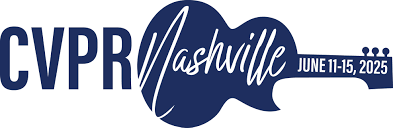

<h1 align="center"> 3D Perception </h1>

 
<!-- sheilds: https://shields.io/ -->
<!-- hits badge: https://hits.seeyoufarm.com/ -->

https://user-images.githubusercontent.com/27915819/161392594-fc0082f7-5c37-4919-830a-2dd423c1d025.mp4

>**BEV(Bird's-eye View) representation 이란?** 2D 이미지 feature를 3D로 projection 하여 BEV feature를 추출하는 연구 분야입니다. 저희는 스터디를 통해 BEV representation을 깊이 탐구하고, 구현 과정에서의 어려움(e.g. MMCV)을 함께 해결하며 성장하는 것을 목표로 합니다. 2025 CVPR 챌린지에 참여하며 BEV representation을 이용한 프로젝트도 진행할 예정입니다!

## 🌟 프로젝트 개요 (Project Overview)
### 1️⃣ Study: BEV Representation
- 2D 이미지 feature를 3D BEV로 projection 하는 방법에 대한 스터디
- 3D Perception task(3D Detection, Map segmentation)에 적용하는 방법 스터디

### 2️⃣ Sharing: Blog or Youtube
- 스터디 발표 유튜브 or 블로그로 남기기
- 발표자 이외의 러너는 질문 하나씩 하기

### 3️⃣ Project: 2025 CVPR Challenge

- CVPR 챌린지 참가하며 BEV representation을 직접 구현
- 참여하는 챌린지는 OT에서 공개할 예정입니다.

## 🤗 역동적인 팀 소개 (Dynamic Team)

| 역할          | 이름 | 주요 관심 분야                          | SNS |
|:---------------:|:------:|:----------------------------------------:| :---: |
| **Project Manager** | 조경호 | 자율주행/3D Vision |  |
| **Member** | Your name | Anything | |
| **Member** | Your name | Anything | |
| **Member** | Your name | Anything | |
| **Member** | Your name | Anything | |
| **Member** | Your name | Anything | |

## 📅 주차별 활동 (Activity History)

| 날짜 | 내용 | 발표자 |
| :--------: | ---- | :----: |
| 2025/03/03 | OT | 조경호 |
| 2025/03/10 | [PointBeV: A Sparse Approach to BeV Predictions](https://arxiv.org/abs/2312.00703) | TBD |
| 2025/03/17 | [Lift, Splat, Shoot: Encoding Images From Arbitrary Camera Rigs by Implicitly Unprojecting to 3D](https://arxiv.org/abs/2008.05711) | TBD |
| 2025/03/24 | ✨Magical Week✨ |  |
| 2025/03/31 | [BEVDet: High-performance Multi-camera 3D Object Detection in Bird-Eye-View](https://arxiv.org/abs/2112.11790) | TBD |
| 2025/04/07 | [BEVDepth: Acquisition of Reliable Depth for Multi-view 3D Object Detection](https://arxiv.org/abs/2206.10092) | TBD |
| 2025/04/14 | [BEVFormer: Learning Bird's-Eye-View Representation from Multi-Camera Images via Spatiotemporal Transformers](https://arxiv.org/abs/2203.17270) | TBD |
| 2025/04/21 | [FB-BEV: BEV Representation from Forward-Backward View Transformations](https://arxiv.org/abs/2308.02236) | TBD |
| 2025/04/28 | ✨Magical Week✨ |  |
| 2025/05/05 | [BEVFusion: Multi-Task Multi-Sensor Fusion with Unified Bird's-Eye View Representation](https://arxiv.org/abs/2205.13542) | TBD |
| 2025/05/17 | 🎉Pseudo Conference🎉 |  |
| 2025/05/19 | [GaussianBeV: 3D Gaussian Representation meets Perception Models for BeV Segmentation](https://arxiv.org/abs/2407.14108) | TBD |
| 2025/05/26 |  | TBD |
| 2025/06/02 |  | TBD |

*PseudoCon과 Magical Week는 가짜연구소 행사이므로 해당 주간은 스터디를 진행하지 않습니다!

<!--## 💡 학습 자원 (Learning Resources)
**우리가 만든 지식 허브**  
- Youtube(준비중)
- Blog-->

## 🌱 참여 안내 (How to Engage)
**팀원으로 참여하시려면 러너 모집 기간에 신청해주세요.**  
- 링크(2/19일 공개)
- 자율주행 or 컴퓨터 비전 분야에 관심이 있는 분을 찾습니다!
- 필수 사항은 아니지만, 코딩 경험이 있다면 알려주세요!

<!-- **누구나 청강을 통해 모임을 참여하실 수 있습니다.**  
1. 특별한 신청 없이 정기 모임 시간에 맞추어 디스코드 #Room-?? 채널로 입장
2. Magical Week 중 행사에 참가
3. Pseudo Lab 행사에서 만나기 -->
