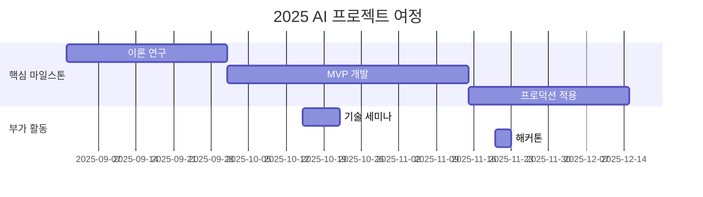

# BEV Perception

<h1 align="center"> BEV Perception </h1>

<div align="center">
<a href="https://pseudo-lab.com"></a>
<a href="https://discord.gg/EPurkHVtp2"></a>
</div>
<br>

<!-- sheilds: https://shields.io/ -->
<!-- hits badge: https://hits.seeyoufarm.com/ -->

Welcome to BEV Perception repository! We aim to study bird's-eye-view(BEV) perception method for autonomous driving, offering tools and frameworks for view transformation, sensor fusion, and 3D perception. Join us in advancing the field of autonomous driving perception through open collaboration and innovation!

## 🌟 프로젝트 목표 (Project Vision)
_"BEV Perception: 2D -> 3D projection"_  
- BEV Perception의 
- 개인 성장과 집단 지혜의 시너지 창출
- 오픈소스 정신을 바탕으로 한 지식 공유 문화
- 실패를 성공의 디딤돌로 만드는 실험적 접근


## 🧑 역동적인 팀 소개 (Dynamic Team)

| 역할          | 이름 |  기술 스택 배지                                                                 | 주요 관심 분야                          |
|---------------|------|-----------------------------------------------------------------------|----------------------------------------|
| **Project Manager** | 조경호 |   | 자율주행/3D Vision |
| **Member** | 레오나르도 다빈치 |   | 데이터 파이프라인 설계                  |


## 🚀 프로젝트 로드맵 (Project Roadmap)



## 🛠️ 우리의 개발 문화 (Our Development Culture)
**우리의 개발 문화**  
```python
class CollaborationFramework:
    def __init__(self):
        self.tools = {
            'communication': 'Discord',
            'version_control': 'GitHub Projects',
            'ci/cd': 'GitHub Actions',
            'docs': 'Github Wiki'
        }
    
    def workflow(self):
        return """주간 사이클:
        1️⃣ 월요일: 스프린트 플래닝 (Notion 타임라인 공유)
        2️⃣ 수요일: 코드 리뷰 세션 (Live Share)
        3️⃣ 금요일: 데모데이 (실제 적용 사례 발표)"""
```


## 📈 성과 지표 (Achievement Metrics)
**2024 주요 KPI**  
| 지표                     | 목표치 | 현재 달성률 |
|--------------------------|--------|-------------|
| 커밋 수                  | 주 1회  | 1%         |
| 기술 블로그 게시물       | 주 1회   | 1편        |


## 💻 주차별 활동 (Activity History)

| 날짜 | 내용 | 발표자 | 
| -------- | -------- | ---- |
| 2025/02/ | OT       |      |
| 2025/02/ |  Part 1. | 미정 | 
| 2025/02/ |  Part 2. | 미정 | 
| 2025/02/ |  Part 3. | 미정 | 
| 2025/03/ |  Part 4. | 미정 | 
| 2025/03/ |  Part 5. | 미정 | 


## 💡 학습 자원 (Learning Resources)
**우리가 만든 지식 허브**  
- (준비중)


## 🌱 참여 안내 (How to Engage)
**팀원으로 참여하시려면 러너 모집 기간에 신청해주세요.**  
- 링크 (준비중)

**누구나 청강을 통해 모임을 참여하실 수 있습니다.**  
1. 특별한 신청 없이 정기 모임 시간에 맞추어 디스코드 #Room-?? 채널로 입장
2. Magical Week 중 행사에 참가
3. Pseudo Lab 행사에서 만나기
