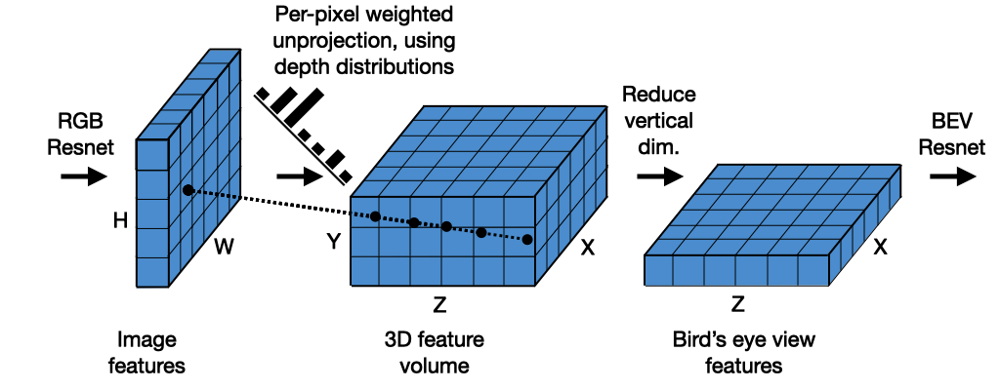
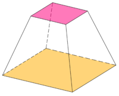
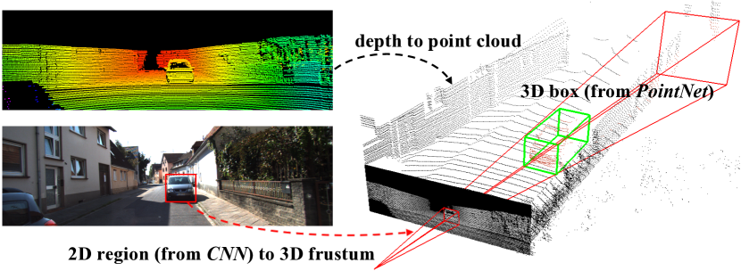
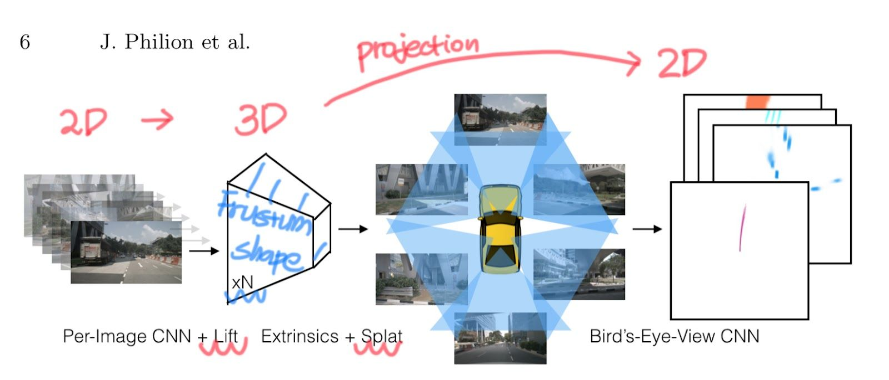

논문 리뷰에 앞서 기본 개념 정리, 논문 리뷰 내용 2부로 구성을 했습니다. 참고 부탁드립니다.

# 1. 자율주행 시스템의 센서 이해

## 1-1 Camera Rig란?

카메라 리그(Camera Rig)는 여러 개의 카메라가 설치된 시스템을 의미한다. 이 시스템은 주로 자율 주행차와 같은 환경에서 사용된다. Arbitrary camera rigs도 마찬가지로 다양한 구성과 배치로 설치된 카메라 시스템을 의미하는데, 동일하게 여러 개의 카메라가 서로 다른 위치와 방향으로 설치되어, 각기 다른 시점에서 이미지를 촬영하는 환경을 의미한다. 이러한 이미지를 통합하여 차량 주변의 3D 환경을 이해하는 것이 중요하다.

Lift, Splat, Shoot 방법은 이러한 arbitrary camera rigs에서 얻은 이미지를 3D로 재구성하는 데 사용된다. 재구성한 3D Representation을 하나의 bird's-eye-view (BEV) 좌표계로 변환하여 통합한다.

## 1-2 Integral Image란?

입력 영상의 픽셀 값을 누적하여 특정 직사각형 영역의 합을 빠르게 계산할 수 있는 데이터 구조를 의미한다. 특정 영역의 합을 단순히 몇 번의 덧셈으로 효율적으로 구할 수 있다. 예를 들어, 직사각형 영역 내의 픽셀 합은 해당 영역의 네 꼭짓점에서 계산된 누적값들을 조합하여 빠르게 구할 수 있다.
<iframe width="560" height="315" src="https://youtu.be/5ceT8O3k6os" frameborder="0" allowfullscreen> </iframe>

이 영상을 참고로 이해할 수 있다.

## 1-3 Camera Parameters 개념

이미지 출처: 논문 Robust BEV 3D Object Detection for Vehicles with Tire Blow-Out

| **용어** | **설명** |
| --- | --- |
| **Extrinsic Translation** | 카메라가 3D 공간에서 이동한 거리 |
| **Extrinsic Rotation** | 카메라가 3D 공간에서 회전한 정도 |
| **Image Permutation** | 이미지 픽셀을 랜덤하게 섞거나 재배열 |
| **Image Translation** | 이미지 전체를 특정 방향으로 평행 이동 |

1. Extrinsic Translation
    - 카메라의 외부 파라미터(Extrinsic Parameters) 중 하나로, 카메라의 위치(위치 변화, Translation) 를 의미함
    - 보통 3D 공간에서의 카메라의 이동을 나타내는 벡터 $t$로 표현됨
    - 일반적으로 \(t = [t_x, t_y, t_z]^{T}\)형태이며, 카메라의 원점이 기준 좌표계에서 어떻게 이동했는지를 나타냄
    - 카메라가 왼쪽 (-$x$ 방향), 위(+$y$ 방향), 앞(+$z$ 방향)으로 10cm씩 이동하면 $t=[-10, 10, 10]$으로 표현함
1. Extrinsic Rotation
    - 카메라의 외부 파라미터(Extrinsic Parameters) 중 하나로, 카메라의 회전(Orientation, Rotation)을 의미함
    - 보통 3x3 회전 행렬($R)$ 또는 3D 회전 벡터($\theta$)로 표현됨
    - 카메라가 오른쪽으로 90도 회전하면, 회전 행렬 $R$이 $y$축을 중심으로 변환됨
1. Image Permutation
    - Permutation(순열)은 픽셀의 위치를 임의로 변경하는 변환을 의미함
    - 보통 픽셀의 위치를 뒤섞거나, 재배열하는 방식으로 이미지 변형이 일어남
    - 머신러닝과 Computer Vision에서 데이터 증강(Augmentation)이나 암호화(Encryption) 기술로 활용됨
    - 예시로 이미지의 각 픽셀을 랜덤하게 섞고, 특정 블록 단위로 픽셀을 섞는 경우가 있음
1. Image Translation
    - 이미지의 모든 픽셀을 특정 방향으로 이동시키는 변환을 의미함
    - 2D 변환 행렬을 사용하여 이미지 좌표를 평행 이동할 수 있음
    - 보통 $\mathbf{T} =
      \begin{bmatrix}
        1 & 0 & t_x \\
        0 & 1 & t_y \\
        0 & 0 & 1
      \end{bmatrix}$ 형태의 변환 행렬을 사용합니다.
    - 이미지를 오른쪽으로 50px, 아래로 30px 이동시키면 $T=(50, 30)$

이 논문의 핵심 기여를 이해하기 위해서는 다음 네 가지 변환과 그에 따른 모델의 특성을 이해해야 한다.

- **Extrinsic Translation (카메라 위치 이동)**
    - 모델은 "Rough equivariance"를 유지한다. 카메라가 이동하더라도 BEV 표현이 크게 왜곡되지 않고 기본 구조를 유지한다.
- **Extrinsic Rotation (카메라 회전)**
    - 마찬가지로 "Rough equivariance"를 보인다. 카메라가 회전할 때 BEV 표현도 어느 정도 따라 회전하지만, 완벽한 회전 불변성은 아니다.
- **Image Permutation (이미지 순서 변경)**
    - Lift-Splat Pooling 덕분에 "정확한 permutation invariance"를 가진다. 즉, 카메라 이미지의 입력 순서가 바뀌어도 동일한 결과가 나온다.
    - 이는 각 카메라의 정보를 먼저 개별 처리한 후 BEV 공간에서 통합하기 때문이다.
- **Image Translation (이미지 이동)**
    - 모델은 "Rough invariance"를 보인다. 이미지 내에서 약간의 이동이 있어도 BEV 표현은 거의 영향을 받지 않는다.

이러한 특성은 모델이 각각의 변환에 대해 얼마나 안정적으로 작동하는 지를 보여주는 중요한 지표이다. "Invariance"는 변환에도 결과가 불변함을, "Equivariance"는 입력의 변환이 출력에도 일관되게 반영됨을 의미한다.

| 변환 유형 | 유지되는 성질 | 의미 |
| --- | --- | --- |
| **Extrinsic Translation** | Rough Equivariance | 카메라 위치가 바뀌어도 BEV 표현이 크게 왜곡되지 않음 |
| **Extrinsic Rotation** | Rough Equivariance | 카메라가 회전해도 BEV 표현이 어느 정도 일관성을 유지 |
| **Image Permutation** | Exact Permutation Invariance | 카메라 이미지 순서가 바뀌어도 BEV 표현이 동일 |
| **Image Translation** | Rough Invariance | 이미지가 픽셀 단위로 이동해도 BEV 표현이 크게 영향을 받지 않음 |

## 1-4 Isometry란?

- Isometry(등거리 변환)은 **거리와 각도를 보존하는 변환**을 의미한다.
- 대표적인 isometry 변환에는 평행 이동(translation)과 회전(rotation)이 있다.
  
    → 자율주행 차량이 움직이거나 회전해도, 실제 환경 자체는 바뀌지 않고 그대로 유지되어야 함
    
    → 이 개념을 ego-frame에서 적용하면, 모델이 같은 공간을 본다면 차량이 움직이더라도 동일한 결과를 예측해야 함
    

이 개념이 중요한 이유는 자율주행 환경에서는 차량이 계속 이동하고 회전하기 때문에 같은 환경을 다양한 위치에서 바라볼 수 있어야 한다. 모델이 이런 변화를 고려하지 못한다면, 같은 장면을 다른 방식으로 해석하는 오류가 발생할 수 있다. 따라서 모델이 Isometry Equivariance를 가지면 차량의 이동과 회전에 대해 일관된 출력을 낼 수 있다.

예를 들어, 자율주행 차량이 정지 상태에서 BEV를 생성하면 도로와 차선, 차량을 잘 탐지한다. 이때 차량이 앞으로 이동했을 때, 이전 BEV 예측 결과도 동일하게 이동한 형태여야 한다.

## 1-5 Ego-frame Isometry Equivariance

- Ego-frame isometry equivariance는 자율주행 차량(ego vehicle)의 참조 좌표계(ego-frame)에서 이루어지는 변환에 대해 모델이 등변성(equivariance)을 유지해야 한다는 개념이다.
- 쉽게 설명하면, 자율주행 차량의 좌표계에서 특정 변환(예: 평행 이동, 회전)이 발생했을 때, 모델의 출력도 동일한 방식으로 변환되어야 한다는 의미이다.
    - Ego-frame은 자율주행 차량을 중심으로 한 좌표계이기 때문에 자율주행 차량의 위치를 (0,0,0)으로 두고, 주변 객체들의 위치를 상대적으로 표현하는 좌표계이다.
    - Ego-frame은 차량이 움직이더라도 항상 차량을 중심으로 좌표를 표현하는 방식이기 때문에, 차량이 이동하거나 회전하면 환경이 변하는 것처럼 보임

## 1-6 LSS 논문에서 Ego-frame Isometry Equivariance를 보장하는 방법

LSS 모델은 BEV representation을 만들 때, Lift-Splat pooling을 사용하여 이 성질을 최대한 유지하려고 한다.

- Lift 과정에서 이미지를 3D 공간으로 변환할 때, camera extrinsics를 사용하여 등변성을 유지하려고 함
- Splat 과정에서 3D 정보를 BEV로 투영할 때, extrinsics의 변화를 고려하여 정렬을 유지하려고 함

결과적으로, 차량이 이동해도 모델의 BEV 표현이 동일한 방식으로 변환되어 차가 움직여도 모델이 같은 방식으로 이해할 수 있도록 만든다.

# 2 BEV Representation 개념

일반적으로 카메라는 전방(View-Frustum)에서 2D 이미지 데이터를 획득하지만, 자율 주행이나 로봇 비전에서는 주변 환경을 3D로 이해하는 것이 중요하다. 따라서 2D 이미지에서 얻은 정보를 3D 공간으로 변환한 후, 다시 위에서 내려다본 형태(BEV)로 투영하여 표현한다.  이 과정에서 차량, 차선, 보행자, 도로 정보 등을 3D 공간에서 위치 정렬한 후 2D 평면에 투영하여 사용한다.

LSS 논문에서도 (2D → 3D → BEV)의 순서로 BEV Representation을 생성하는데, 아래 이미지를 통해 이해를 도울 수 있다.

HxW size를 가진 2D Image 입력값이 어떻게 BEV가 되는가? 이걸 3단계로 나누어서 설명하고, 그게 이 논문의 제목이다. Lift! Splat! Shooting!

2D 이미지에서 feature을 추출하고 각 픽셀마다 깊이 분포를 추정한다. 이를 통해 2D features를 3D 공간으로 들어올려 Frustum 형태의 3D features point cloud를 생성한다.

여러 카메라에서 생성된 3D Frustum features를 하나의 공통된 BEV 공간으로 Projection한다. 이 과정에서 효율적인 연산을 위해 Pillar Pooling 기법을 사용하여 특징들을 합친다. (Sum pooling이라고 함)

BEV 공간에서 다양한 경로 후보를 Shooting하여 각 경로의 안전성을 평가한다. 이 단계를 자율주행을 위한 모션 플래닝에 활용한다.

LSS는 여러 카메라의 2D 이미지를 효과적으로 3D BEV Representation으로 변환하고, 이를 직접 자율주행 태스크와 연결하는 end-to-end 구조를 제공한다. 여기까지 이 논문의 컨셉을 preview 했다고 봐주시면 좋을 것 같다.

## **Frustum-shape Point Cloud**

Frustum은 절두체란 이름으로 입체를 절단하는 하나나 두 평행면 사이의 부분이라는 정의를 갖고 있다.

Frustum과 BEV 개념을 처음 접하면 되게 생소하게 다가오는데, Frustum-shape Point Cloud는 3D Object detection에서 사용되는 데이터 형태로 카메라의 시야에 기반한 특정 3D 공간 영역이다.

이 영역은 일반적으로 절두체(Frustum) 모양으로 카메라의 시야 각에 따라 가까운 면(Near Plane)과 먼 면(Far Plane)을 잘라낸 피라미드 형태를 가진다.

주로 2D Image에서 객체의 경계 상자를 검출한 후, 이를 3D로 확장하여 Frustum 영역을 설정하게 되는데 이는 2D와 3D 데이터를 연결하는데 중요한 역할을 한다.

이미지 출처: 논문 Frustum PointNets for 3D Object Detection from RGB Data

위 그림을 참고로 하여서 2D 이미지에서 Depth가 추가되어 3D Box 형태가 되었음을 볼 수 있다. LSS 논문에서 Fig. 4에서도 Lift하는 과정이 이에 해당되며 절두체 모양을 볼 수 있다.

다시 정리하면 2D 이미지를 입력으로 받아 깊이 추정(Depth Estimation)을 통해 Frustum-shaped Point Cloud를 생성하였고, 이는 객체 탐지 또는 BEV Presentation 생성에 사용된다.

## **Trajectories(궤적)이란?**

자율 주행 차량이나 객체가 이동하는 경로를 의미하는데, 어떤 차량이 특정 시점부터 미래의 몇 초 동안 어디로 움직일지 예측하는 것을 의미한다. 자율 주행에서는 차량이 올바르게 주행하기 위해 최적의 trajectory를 찾는 것이 중요한데, 이를 motion planning(경로 계획)이라고 한다.

모델은 여러 개의 가능한 trajectory 후보들을 생성하고, 그중 최적의 경로를 선택한다. 가장 안전하고 효율적인 경로 선택하는 것이 중요하기에 미리 정의된 다양한 궤적 중에서 하나를 선택하는 방식을 사용한다.

## **Template Trajectory란?**

Template Trajectory는 미리 정의된 고정된 궤적(trajectory)을 의미한다.

모델이 궤적을 직접 생성하는 것이 아니라, 미리 만들어진 몇 개의 궤적 중에서 선택하는 방식인데, 예시로

- **Template 1:** 직진하는 궤적
- **Template 2:** 우회전하는 궤적
- **Template 3:** 좌회전하는 궤적
- **Template 4:** 차선을 변경하는 궤적

이 있다.

### **왜 Template Trajectory를 사용할까?**

자율주행 차량이 완전히 새로운 궤적을 매번 생성하면 계산량이 너무 많아지고 예측이 불안정할 수 있기 때문이다. 따라서 미리 만들어진 여러 개의 가능한 궤적 중에서 하나를 선택하는 방식이 더 효율적이고 안정적으로 볼 수 있는데, 이는 마치 운전자가 운전할 때 미리 정해진 길 중 하나를 선택해서 가는 것과 비슷하다.

## **Expert Trajectory란?**

Expert Trajectory(전문가 궤적)는 실제 사람이 운전한 데이터에서 얻은 "이상적인" 궤적을 의미한다. 경험이 많은 운전자가 최적의 경로를 따라갔다면, 그 경로를 모델이 학습하도록 하는 것이다.

학습 데이터에 사람이 직접 운전한 궤적(trajectory)이 있으면, 모델은 이 expert trajectory를 학습하면서, 최적의 주행 경로를 예측하도록 훈련된다. 따라서 모델이 나중에 자율주행을 할 때, 사람이 했던 운전 패턴을 참고해서 가장 자연스러운 궤적을 선택한다.

### **왜 Expert Trajectory를 사용할까?**

모델이 학습할 때 완전히 랜덤한 궤적을 따르는 것이 아니라 실제 사람이 운전한 궤적을 기준으로 배우기 때문이고, 모델이 자율주행을 할 때 보다 자연스럽고 안전한 주행 경로를 선택할 수 있다.

## **Trajectory Prediction 방식 비교 (Template vs. 직접 생성)**

위에서 설명했듯, 자율주행에서 경로 예측(trajectory prediction)을 하는 방법은 크게 두 가지로 나뉜다.

| **방식** | **설명** | **장점** | **단점** |
| --- | --- | --- | --- |
| **Template Trajectory 선택** | 미리 정의된 여러 궤적 중 하나를 선택 | 빠르고 안정적 | 유연성이 부족할 수 있음 |
| **직접 궤적 생성** | 모델이 완전히 새로운 궤적을 생성 | 유연함 (어떤 경로든 가능) | 계산량이 많고 불안정할 수 있음 |

LSS 논문에서는 Template Trajectory 방식을 사용하여 모델이 미리 정의된 Trajectory 중에서 가장 적절한 것을 선택하는 방식으로 Motion Planning을 수행한다. 결국 Fixed Template Trajectory도 classification의 Task라 볼 수 있으며, 이 과정 또한 미리 정의된 Trajectory 후보들 중에서 가장 적절한 것을 고르는 것이므로 분류(Classification) 문제로 변환하여 Cost map을 정의하여 최적화하며 학습한다.

## **Oracle이란?**

Oracle은 실험에서 "항상 올바른 답을 제공하는 가상의 존재"를 의미한다. Oracle 실험은 실제 시스템과 시스템의 특정 구성 요소가 항상 올바르게 작동한다고 가정했을 때의 성능을 비교하는 데 사용된다.

예를 들어, LSS 논문에서는 "Oracle Depth"라는 표현을 사용하며, 이는 LIDAR 포인트 클라우드에서 얻은 실제 깊이 정보이다. 이는 카메라 이미지만으로 깊이를 추정하는 Lift-Splat 모델과 비교하기 위한 "이상적인 기준"으로 사용된다.

이 실험의 주요 목적은

1. 시스템의 이론적 성능 상한을 확인하기 위해
2. 시스템의 특정 구성 요소가 전체 성능에 미치는 영향을 정량화하기 위해
3. 개선이 필요한 부분을 식별하기 위해

서 이다.

