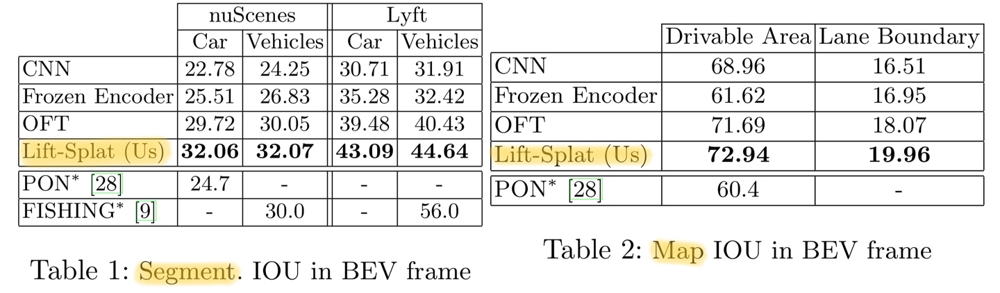

## Lift, Splat, Shoot: Encoding Images from Arbitrary Camera Rigs by Implicitly Unprojecting to 3D

[Jonah Philion](https://scholar.google.com/citations?user=VVIAoY0AAAAJ&hl=en), [Sanja Fidler](http://www.cs.toronto.edu/~fidler/)

NVIDIA, Vector Institute, University of Toronto

ECCV 2020

"Lift, Splat, Shoot" 논문은 임의의 카메라 rig에서 멀티뷰 이미지 데이터를 입력받아 bird's-eye-view (BEV) 좌표계에서 의미 정보를 출력하는 모델을 설계하는 것을 목표로 한다. 이 모델은 주로 **BEV 차량 분할**, **BEV 차선 분할**, **주행 가능한 영역 분할**, 그리고 **모션 계획**과 같은 작업에 사용됨.

## **Task**

- Bird’s-Eye-View (BEV) vehicle segmentation
- Bird’s-Eye-View lane segmentation
- Drivable area segmentation
- **Motion planning**

## **주요 아이디어**

- **Lift**: 2D 이미지를 3D로 변환하는 과정으로, 각 픽셀에 대해 이산적인 깊이 집합을 사용하여 attention-style operation을 수행한다. 이 과정에서 각 픽셀은 여러 깊이에서 context feature를 생성한다.
- **Splat**: Lift 단계에서 생성된 3D 포인트 클라우드를 BEV 평면으로 투영하는 과정이다. 이를 통해 pillar pooling을 사용하여 효율적인 sum pooling을 수행할 수 있다.
- **Shoot**: BEV에서 생성된 feature map을 사용하여 모션 계획을 수행한다. 이는 고정된 템플릿 궤적에 대한 분류 문제로 정의되며, 각 템플릿 궤적의 로짓 값은 모델이 출력하는 BEV 비용 지도에서 해당 궤적이 지나는 지점의 값을 합산하여 계산된다.

## **네트워크 구조**

- **Per-image CNN**: 각 이미지에서 feature를 추출하는 역할
- **Bird’s-Eye-View CNN**: BEV 평면에서 최종적인 의미 정보를 추출하는 역할
- **Lift-Splat Pooling Layer**: Lift와 Splat 단계를 통해 생성된 3D 포인트 클라우드를 BEV 평면으로 변환하는 역할

## **학습 및 성능**

- **End-to-end Motion Planning**: 모델은 expert trajectory의 likelihood를 최대화하도록 학습
- **Equivariance**: 모델은 다양한 BEV 좌표계에서 일반화될 수 있도록 설계됨. 이는 extrinsic translation, rotation, image permutation, image translation에 대해 equivariance를 유지.
- **성능**: BEV 분할 작업에서 기존 방법보다 우수한 성능을 보였으며, 다른 카메라 rig에서도 전이 가능성을 검증함. nuScenes 데이터셋에서 학습 후 Lyft 데이터셋에서 테스트하여 다른 카메라 rig에서의 성능을 평가했다.

## **추가 설명**

- **Implicit 3D Reconstruction**: Lift-Splat Pooling을 통해 명시적인 깊이 정보 없이도 3D 정보를 암시적으로 재구성할 수 있다. 이는 카메라의 extrinsic 및 intrinsic 파라미터에 의존하지 않아도 되며, 다양한 카메라 설정에서도 잘 작동하였다.
- **Multi-View Perception**: 이 모델은 여러 카메라의 입력을 하나의 BEV 좌표계로 통합하여, 차량의 주변 환경을 효과적으로 이해할 수 있다. 이는 자율 주행차의 perception 시스템에서 중요한 역할을 한다.

---

## Method

방법론은 아래 그림처럼 2D 이미지를 BEV로 변환하고, 이후 모션 계획과 같은 다운스트림 작업을 위한 과정을 설명한다.

## 3.1 Lift

여기서 "Lift" 과정은 2D 이미지를 3D로 변환하는 과정을 의미한다. Per-image CNN은 각 픽셀에 대해 discrete depth set을 사용한 attention-style operation을 수행하여 3D 공간으로 확장한다.

### 1. **Lift 단계에서 Contextual Feature 생성**

- Lift 단계에서는 각 카메라 이미지의 픽셀별로 **깊이 분포(Depth Distribution)**를 예측하고, 이를 기반으로 3D 공간 상의 **Frustum-shaped Point Cloud**를 생성한다.
- 이 과정에서 픽셀의 RGB 값 대신, 딥러닝 네트워크가 생성한 **Contextual Feature Vector**를 사용한다.
- 이 벡터는 단순히 픽셀의 색상 정보만이 아니라, 해당 픽셀이 나타내는 장면의 고차원적 의미(예: 객체의 종류, 위치, 주변 환경 등)를 포함한다.

### 2. **Feature와 Depth의 결합**

- 각 픽셀에 대해 네트워크는 깊이 분포(Depth Probability Distribution)와 Contextual Feature Vector를 결합하여, 3D 공간에서의 특징 벡터를 생성한다. 이 과정은 다음과 같이 표현된다.

$c_d = \alpha_d \cdot c$

- 여기서 $c$는 Contextual Feature Vector, $\alpha_d$는 특정 깊이에 대한 확률값이다. 이를 통해 각 픽셀이 여러 깊이에 걸쳐 가지는 문맥적 정보를 반영할 수 있다.

Lift 단계에서 딥러닝 네트워크가 생성하는 **Contextual Feature Vector**와 이를 기반으로 한 Depth-aware Representation이 문맥적 정보를 포함하는 근거이다. 이는 단순한 픽셀 값이 아닌 고차원적인 장면 이해를 가능하게 하며, 최종적으로 BEV 맵에서도 유지된다.

### 3. Discrete Depth Set

- Discrete Depth Set은 2D 이미지에서 3D BEV 표현을 만들기 위해, 미리 정해진 이산적인(depth values) 집합을 기반으로 픽셀의 깊이를 추정하는 방법이다.
    - Discrete Depth Set을 미리 정의해두고, 그중 하나를 선택하는 방식으로 바꿔 분류 문제로 변환한다.
- Lift-Splat-Shoot 모델에서는 픽셀별로 이산적인 Depth 값에 대한 확률을 예측하고, 이를 기반으로 3D로 변환(Lift)한 후 BEV로 투영(Splat)하는 방식을 사용한다.

- 이미지에서 픽셀별 깊이(Depth)를 추정하기 위해 사용하는 **미리 정의된 깊이 값의 집합**은, 각 픽셀을 **3D 공간으로 변환하기 위한 기준 역할**을 한다.
- 일반적인 RGB 이미지에는 깊이 정보가 포함되지 않으므로, BEV(Bird’s Eye View) 표현을 생성하려면 각 픽셀의 3D 위치를 계산해야 한다.
- 이를 위해 픽셀의 깊이를 추정하여 카메라와의 거리를 계산하며, 주로 다음 방법들이 사용된다:
    - **Steoreo Vision(스테레오 비전)**: 두 카메라로 얻은 시차를 분석해 깊이를 계산
    - **Depth Sensor(깊이 센서)**: LiDAR나 ToF 센서를 통해 직접 거리 측정
    - **Monocular Depth Estimation(단안 깊이 추정)**: 단일 RGB 이미지에서 딥러닝 모델로 깊이를 예측

하지만 연속적인(continuous) 깊이를 직접 예측하는 것은 어려우므로 일정한 개수의 이산적인(discrete) 깊이 값들을 미리 정하고, 각 픽셀이 어느 깊이에 속하는지 예측하는 방식을 사용한다.

- **각 픽셀이 특정 깊이에 존재할 확률을 예측 (Per-Pixel Depth Probability Distribution)**
    - 픽셀마다 **Discrete Depth Set에 대해 확률값을 예측**
- **픽셀을 3D 공간으로 "Lift" (Unprojection to 3D)**
    - 예측된 Depth 값과 카메라의 Intrinsics(내부 파라미터)을 사용하여, **픽셀을 3D 공간 좌표(x, y, z)로 변환**
    - 즉, **2D 이미지의 픽셀을 3D 점(3D Point Cloud)으로 변환하는 과정**

### **4. Discrete Depth Set이 가지는 특징**

- 연속적인 Depth 예측 대신, 미리 정한 Depth 값들 중 하나를 선택하는 방식
- Depth를 직접 회귀(regression)하는 것이 아니라, 분류(classification) 문제로 변환
- 모델이 학습하기 쉽고, BEV 표현을 생성하는데 효과적
- Depth의 해상도는 사용된 Discrete Depth Set의 개수에 따라 달라짐

- 읽으며 생겼던 질문 1 (Discrete vs. Continuous)
    
    ### 질문: 연속적인 Depth 값을 직접 예측하는 것이 항상 어렵고 불안정한 것인지? 또는 BEV 변환과 같은 특정 문제에서만 어렵게 해당하는 것인지?
    
    - 카메라만 사용하면 깊이 정보가 없음
    - 인간은 두 눈으로 원근법(perspective)을 사용하여 거리감을 인식하지만, 카메라로 찍은 2D 이미지에는 깊이에 대한 직접적인 정보가 없음
    - 즉, 깊이를 예측하려면 모델이 학습을 통해 추론해야 하는데, 이는 매우 어렵고 불안정 함
    - BEV 변환에서는 Discrete Depth Set을 사용해서 분류(Classification) 문제로 변환하는 것이 더 안정적인 경우가 많음
    - Depth 예측은 기본적으로 어려운 문제지만, **Discrete Depth Set을 사용하면 학습이 더 쉽고 안정적이기 때문에, BEV 변환 같은 작업에서 자주 사용됨**
    - LiDAR 기반의 Depth Estimation 모델이라면 연속적인 Depth 값을 직접 예측할 수 있음
    - LiDAR(Depth 센서 존재) 등 깊이를 직접 측정할 수 있거나, 깊이 범위가 일정한 경우에는 Regression(연속적인 Depth 예측)이 가능함

---

## 3.2 Splat

- **3D 공간을 BEV(Bird’s-Eye-View)로 "Splat"**
    - 변환된 3D 점들을 수직 방향으로 내려다보면서 2D BEV 맵으로 투영

### **Splat 단계에서 BEV로 투영**

- 이렇게 생성된 Frustum-shaped Point Cloud는 BEV(Bird's-Eye View) 공간으로 투영(splat)되며, 이 과정에서도 Contextual Feature가 유지된다.
- BEV 공간의 각 셀(cell)은 주변 포인트들의 Contextual Feature를 집계(sum pooling)하여 표현되므로, 단순한 위치 정보뿐 아니라 문맥적 의미를 포함하게 된다.

### **Splat: Pillar Pooling**

- **BEV 평면으로의 투영**: Lift 단계에서 생성된 대규모 포인트 클라우드를 bird's-eye-view (BEV) 평면으로 투영하는 과정이다. 이 과정은 motion planning과 같은 다운스트림 작업에 적합한 형태로 데이터를 변환하는 데 중요한 단계이다.
- **필러 할당**: PointPillars 아키텍처를 따르며, 각 포인트를 무한한 높이를 가진 복셀인 "필러"에 할당한다. 이렇게 하면 3D 공간의 포인트 클라우드를 효율적으로 2D BEV 평면으로 변환할 수 있다.
- **Sum pooling**: 각 필러에 할당된 포인트들의 feature를 합하여 C×H×W 크기의 텐서를 생성한다. 여기서 C는 context feature vector의 차원, H와 W는 BEV 평면의 크기를 나타낸다.
- **Cumsum Trick**: 합 풀링을 효율적으로 수행하기 위해 "누적 합 트릭(cumsum trick)"을 사용한다. 이는 포인트들을 위치에 따라 정렬한 후, integral image와 유사한 방식으로 계산하여 빠른 연산을 가능하게 한다. 이 방법은 메모리 사용을 줄이고, autograd를 통해 효율적으로 학습할 수 있도록 해준다.

### **빠른 연산이 가능했던 이유**

1. **Padding 대신 Packing 사용**:
    - 기존 방식에서는 각 "pillar" (3D 공간의 작은 기둥 형태 데이터)에 대해 크기를 맞추기 위해 패딩(padding)을 추가한 후 Sum Pooling을 수행했다.
    - 하지만 패딩은 메모리를 낭비하고 연산 속도를 느리게 한다. 이를 피하기 위해 **packing**이라는 방식을 사용한다. 이는 필요한 데이터만 효율적으로 묶어 처리하는 방법이다
2. **Cumsum Trick**:
    - 데이터를 특정 기준(예: 위치 ID)으로 정렬한 뒤, **누적 합(cumulative sum)**을 계산한다.
    - 이후, 각 "bin"(데이터가 그룹화된 영역)의 경계에서 누적 합 값을 빼는 방식으로 Sum Pooling을 수행한다. 이는 데이터를 빠르게 집계할 수 있도록 도와준다.
3. **효율적인 Gradient 계산**:
    - 이 연산은 자동 미분(autograd)을 통해 모든 단계에서 역전파를 수행하는 대신, **분석적(analytic) gradient**를 직접 계산한다.
    - 이를 통해 학습 속도가 2배 정도 빨라지고 메모리 사용량도 줄어든다.

결론적으로, 이 방법은 패딩 없이 메모리를 절약하면서도 Sum Pooling 연산을 빠르게 수행하고, 학습 과정에서 효율적인 역전파를 가능하게 한다.

### Cumsum Trick → Cumulative Sum Trick 보명

1. **데이터 정렬**:
    - 먼저 모든 데이터 포인트를 **bin ID**(데이터가 속한 그룹 또는 구간)에 따라 정렬한다. 이를 통해 같은 bin에 속한 데이터들이 연속적으로 위치하게 된다.
2. **누적합 계산**:
    - 정렬된 데이터에 대해 각 feature(특징 값)에 대해 **누적합(cumulative sum)**을 계산한다. (이 부분은 위에 Integral Image 설명 참고) 누적합은 특정 위치까지의 모든 값을 합산한 결과이다.
3. **구간별 합 계산**:
    - 각 bin의 경계(boundary)에서 누적합 값을 사용하여 해당 구간(bin)의 합을 계산한다.
    - 구체적으로, 특정 bin의 합은 누적합 배열에서 해당 bin의 끝값에서 시작값을 빼는 방식으로 계산된다.

### 장점:

- **효율성**: 누적합을 한 번 계산하면, 각 bin의 합을 빠르게 구할 수 있다. 이는 기존 방식처럼 개별적으로 합을 계산하는 것보다 훨씬 빠르다.
- **메모리 절약**: 별도의 복잡한 데이터 구조 없이 간단한 배열 연산으로 처리할 수 있다.

### 예시로 이해하기:

- 입력 데이터가 `[1][2][3][4][5]`이고, 두 개의 bin으로 나뉜다고 가정:
    - 첫 번째 bin은 `[1][2][3]`, 두 번째 bin은 `[4][5]`.
    - 누적합은 `[1][3][6]` 이다.
- 첫 번째 bin의 합은 `6 - 0 = 6`, 두 번째 bin의 합은 `15 - 10 = 5`로 계산됨

결론적으로, 이 방법은 데이터를 효율적으로 정리하고 계산하여 Sum Pooling을 빠르게 수행할 수 있도록 돕는다.

---

## 3.3 Shooting

- BEV(Bird's-Eye-View) 공간에서 **모션 플래닝(Motion Planning)**을 수행하는 과정을 “**Shoot”**
    - 이 단계에서는 BEV 맵에서 **다양한 경로 후보(trajectory)**를 생성하고, 각 경로의 안전성이나 비용(cost)을 평가하여 최적의 경로를 선택함
        - 사전에 정의된 $K$개의 경로 템플릿(trajectory templates)을 사용
        - 각 템플릿에 대해 BEV 맵에서 분류(classification) 문제로 접근해 적합성을 예측
    - **즉, Shoot**은 자율주행 차량이 최적의 이동 경로를 결정하기 위한 마지막 단계이다.

1. Cost Map을 활용하여 다양한 궤적을 평가하고 최저 비용 궤적을 선택한다.
2. K개의 템플릿 궤적 분포를 예측하여 계획을 수립한다. 이 분포는 Cost Volume의 특성을 활용하기 위해 볼츠만 분포 형태로 정의된다.
3. 실제로는 K-means Clustering을 통해 템플릿 궤적 집합을 결정한다.

이 모델은 깊이 센서(LiDAR) 없이도 카메라 이미지만으로 조감도 표현을 학습하고, 이를 통해 자율주행 차량의 모션 플래닝을 가능하게 하였다.

### **Learning Cost Maps for Planning**

End-to-end motion planning ("shooting")은 fixed template trajectories에 대한 classification 문제로 정식화된다.

- 각 template trajectory의 logit 값은 모델이 출력하는 BEV cost map에서 해당 궤적이 지나는 지점의 값을 합산하여 계산한다.
- 모델은 expert trajectory의 likelihood를 최대화하도록 학습된다.

### 논문에서 Cost Map 최적화 및 계산 방법

논문에서는 경로 계획(Motion Planning)을 "고정된 템플릿 Trajectory들 중에서 하나를 선택하는 분류(Classification) 문제"로 정의하고 있기 때문에, 이를 위해 각 Trajectory의 logit 값을 BEV Cost Map에서 합산하여 결정하고, Expert Trajectory의 가능도를 최대화하는 방식으로 학습한다.

$p(\tau_i | o) = \frac{\exp\left( - \sum\limits_{(x_i, y_i) \in \tau_i} c_o(x_i, y_i) \right)}{\sum\limits_{\tau \in \mathcal{T}} \exp\left( - \sum\limits_{(x_i, y_i) \in \tau} c_o(x_i, y_i) \right)}$

각 Trajectory $\tau_i$의 선택 확률 $p(\tau_i|o)$는 다음과 같이 Softmax 형태로 정의됨

- $c_o(x_i,y_i)$ :→ BEV Cost Map에서 좌표 $(x_i,y_i)$의 비용(cost) 값
- $\sum\limits_{(x_i, y_i) \in \tau_i} c_o(x_i, y_i)$: 특정 Trajectory $\tau_i$ 위에 있는 모든 좌표의 cost 합산 (해당 Trajectory의 총 비용)
- $exp⁡(−cost)$: 낮은 cost를 가진 Trajectory일수록 선택 확률이 높아지도록 만듦 (최적의 경로는 cost가 낮아야 함)
- Softmax 형태: 여러 Trajectory 중에서 최적의 Trajectory(가장 낮은 cost를 가지는 것)를 확률적으로 선택하도록 학습

- 모델이 학습할 때, Expert Trajectory(전문가가 실제 주행한 궤적)의 가능도를 최대화하도록 Loss를 설정하여서, 모델이 Expert Trajectory의 확률을 높이는 방향으로 Cost Map을 업데이트 함

### **Loss Function (Negative Log-Likelihood Loss)**

모델의 학습 과정에서 사용되는 Loss는 **Negative Log-Likelihood (NLL)**로 정의됨

$L = - \sum\limits_{\tau^* \in \mathcal{T}_{\text{expert}}} \log p(\tau^* | o)$

- 모델이 Expert가 실제로 선택한 Trajectory $\tau^*$의 확률을 최대화하도록 학습됨
- Expert Trajectory의 cost를 낮추도록 Cost Map을 최적화하는 과정
- 이렇게 하면 모델이 나중에 자율주행할 때, 사람이 선택할 법한 최적의 경로를 따라가게 됨

더 직관적으로 이해하기 위해, BEV Cost Map을 조정하여 Expert가 선택한 Trajectory의 비용을 최소화하는 방향으로 모델을 학습한다고 설명할 수 있다.

모델이 처음에는 여러 Trajectory를 비슷한 확률로 선택하다가 학습이 진행되며 Expert가 주행한 경로에 해당하는 BEV Cost가 점점 낮아진다. 결과적으로 모델은 Expert가 선택한 경로를 더 높은 확률로 선택하도록 최적화됨

### 정리

- Cost Map은 각 위치의 주행 비용을 나타내며, 낮은 Cost를 가진 Trajectory가 최적의 경로가 됨
- **모델은 Expert Trajectory의 Cost를 줄이도록 학습되며, Softmax를 이용해 가장 낮은 비용의 Trajectory를 선택**
- **Negative Log-Likelihood (NLL) Loss를 사용하여 Expert Trajectory의 확률을 최대화하는 방향으로 Cost Map을 최적화**

### **Equivariance**

BEV frame에서 추론하는 모델은 다양한 BEV coordinate system에서도 일반화될 수 있어야 함. 이를 위해 모델은 camera extrinsics의 변환에 대해 equivariance를 유지하도록 설계됨.

- Extrinsic Translation → Rough equivariance 유지
- Extrinsic Rotation → Rough equivariance 유지
- Image Permutation → Lift-Splat Pooling은 정확한 permutation invariance 유지
- Image Translation → Rough invariance 유지

**Extrinsic Translation**

**Extrinsic Rotation**

**Image Permutation**

**Image Translation**

---

## Experiments

### 5.2 Segmentation

Lift-Splat 모델은 조감도(BEV) 프레임에서 의미론적 3D 표현을 학습하는 능력을 보여주었다. 실험 결과는 객체 세그멘테이션 태스크와 맵 세그멘테이션 태스크 모두에서 베이스라인 모델들을 능가했다.

### 5.3 Robustness

Lift-Splat-Shoot 모델은 조감도(BEV) CNN이 여러 카메라의 정보를 융합하는 방식으로 학습하기 때문에, 자율주행 환경에서 발생하는 일반적인 노이즈 모델(외부 파라미터 편향이나 카메라 고장 등)에 대한 강건성을 훈련을 통해 향상시킬 수 있었다.

**5.3.1 카메라 드롭아웃에 대한 강건성**

**Lift, Splat, Shoot** 논문에서 언급된 **camera dropping**은 자율주행 차량에 장착된 여러 대의 카메라(예: 6개) 중 일부를 제거하거나 비활성화하여 모델의 성능을 평가하는 실험적 방법이다.

이는 모든 카메라를 사용하는 환경과 비교하여, **카메라 개수가 줄어들었을 때 모델이 얼마나 강건하게 작동하는지**를 확인하기 위한 것이다.

**Camera Dropping의 의도**

1. **강건성(Robustness) 평가**:
    - 모든 카메라가 항상 작동하지 않을 수 있는 실제 상황(예: 장애물로 인한 가려짐, 고장 등)을 가정한다.
    - 특정 카메라가 없는 상태에서도 모델이 유효한 BEV 맵과 경로를 생성할 수 있는지 확인한다.
2. **모델의 일반화 성능 테스트**:
    - 카메라 입력이 줄어들거나 불완전해도 모델이 잘 작동한다면, 이는 모델이 다양한 환경에서도 일반화(generalization) 능력을 가진다는 것을 의미한다.
3. **효율성 분석**:
    - 모든 카메라를 사용하는 경우와 일부만 사용하는 경우의 계산 비용 및 정확도를 비교할 수 있다.

**Camera Dropping 방식**

- **하나씩 제거**: 6개의 카메라 중 하나씩 제거하며 성능 변화를 관찰한다.
- **여러 개 제거**: 동시에 여러 대의 카메라를 제거하여 극단적인 상황에서의 성능을 평가할 수도 있다.

연구팀은 훈련 중 카메라를 의도적으로 제외함으로써 테스트 시 카메라 고장에 더 잘 대응하는 모델을 개발했는데, 흥미롭게도 모든 6개 카메라가 존재할 때 가장 좋은 성능을 보인 모델은 훈련 중 매 샘플마다 무작위로 1개의 카메라를 제외한 모델이었다.

**왜 성능이 높았을까?**

Lift, Splat, Shoot 논문에서 카메라가 하나 없어져도 성능이 비슷하게 유지되는 이유는 **모델의 강건성(Robustness)**과 **멀티뷰 데이터 융합 방식** 때문이다.

1. **멀티뷰 융합의 강건성**

- 이 논문은 여러 카메라에서 얻은 데이터를 **공유된 3D 공간(BEV)**으로 변환하는 과정을 포함한다.
- 이 과정에서 각 카메라의 입력은 **동일한 3D 좌표계로 매핑**되며, 개별 카메라의 손실이 전체 맵에 큰 영향을 주지 않도록 설계되었다.
- 특히, 모델은 **Permutation Invariance**(카메라 순서가 바뀌거나 일부가 없어져도 결과에 영향을 받지 않음)을 보장하도록 설계되어, 일부 카메라가 제거되더라도 전체적인 BEV 맵의 품질이 유지된다.

2. **Redundancy(중복성)**

- 자율주행 차량의 카메라는 서로 겹치는 시야를 가지는 경우가 많다. 따라서 하나의 카메라가 없더라도 다른 카메라에서 동일한 영역을 커버할 수 있어 정보 손실이 최소화된다.

3. **학습 중 Dropout 기법 사용**

- 학습 과정에서 일부 카메라 데이터를 의도적으로 제거(dropout)하는 방식으로 모델을 훈련시켜, 테스트 시 특정 카메라가 없어져도 강건하게 작동하도록 만든다.

4. **Contextual Feature Aggregation**

- Lift 단계에서 각 카메라로부터 추출된 특징(feature)은 단순히 픽셀 단위가 아니라, **문맥적 정보(contextual feature)**를 포함한다.
- 이를 통해 개별 카메라의 정보 손실이 전체적인 BEV 맵 품질에 미치는 영향을 줄인다.
1. **결론**
- 카메라가 하나 없어져도 성능이 유지되는 이유는 모델이 멀티뷰 데이터를 융합할 때 강건성을 보장하도록 설계되었기 때문이다.
- 이는 Permutation Invariance, 중복된 시야, Dropout 학습 기법, 그리고 문맥적 특징 활용 덕분에 가능했다.
- 센서 드롭아웃이 모델에게 서로 다른 카메라의 이미지 간 상관관계를 학습하도록 강제하기 때문으로 추정된다. 이는 다른 드롭아웃 변형들(일반 드롭아웃, 블록 드롭아웃)과 유사한 효과를 보인다.

**5.3.2 외부 파라미터(Extrinsics) 노이즈에 대한 강건성**

외부 파라미터에 노이즈가 있는 상태로 모델을 훈련시키면 테스트 시 성능이 향상될 수 있다. 테스트 시 노이즈가 적을 경우, 노이즈 없이 훈련된 모델이 가장 좋은 성능을 보이는데, 이는 BEV CNN이 splat 위치를 더 신뢰할 수 있기 때문이다. 그러나 외부 파라미터에 높은 수준의 노이즈가 있을 경우, 노이즈와 함께 훈련된 모델이 더 좋은 성능을 유지한다.

**5.3.3 개별 카메라의 중요도 분석**

nuScenes 데이터셋에서 차량 세그멘테이션 성능에 대한 각 카메라의 "중요도"를 측정했다. nuScenes에서 카메라를 잃으면 차량 주변의 특정 영역에 센서 측정값이 없게 되므로, 성능은 전체 센서 리그를 사용할 때의 성능에 의해 엄격하게 상한이 정해진다.

분석 결과, nuScenes 카메라 리그의 후방 카메라는 더 넓은 시야각을 가지고 있어, 이 카메라를 잃을 때 전체 카메라 리그를 사용할 때보다 성능 저하가 가장 크게 나타났다. 이러한 분석은 안전을 위해 어떤 카메라에 센서 중복성이 더 중요한지 제안한다.

**5.3.4 카메라 제거 시 시각적 영향**

연구팀은 단일 타임스탬프에서 각 카메라를 제거하고 네트워크 예측에 미치는 영향을 시각화했다. 누락된 카메라가 커버하는 영역은 모든 경우에 더 흐릿해진다. 전방 카메라가 제거되었을 때(상단 중앙), 네트워크는 자아 앞의 차선과 주행 가능 영역을 추정하고, 우측 상단 카메라에서는 모서리만 보이는 차량의 본체를 추정한다.

이러한 실험들은 Lift-Splat-Shoot 모델이 센서 오류나 고장에 대응하는 강건성을 갖추고 있으며, 적절한 훈련 전략을 통해 이러한 강건성을 더욱 향상시킬 수 있음을 보여준다.

---

### 5.4 Zero-Shot Camera Rig Transfer

Lift-Splat 모델의 일반화 능력을 검증하기 위해 두 가지 실험을 수행했다.

**5.4.1 새로운 카메라 추가 실험**

첫 번째 실험에서는 nuScenes 카메라 리그의 일부 카메라에서만 촬영된 이미지로 모델을 훈련시킨 다음, 테스트 시 나머지 두 카메라의 이미지를 추가로 사용할 때의 성능을 측정했다.

Table 3. 결과에 따르면, 훈련에 사용되지 않은 추가 카메라를 테스트 시 사용할 때 재훈련 없이도 차량 세그멘테이션 성능이 향상되었다:

- 4개 카메라만 사용: 26.53% IOU
- 4개 + 전방 좌측 카메라: 27.35% IOU
- 4개 + 후방 좌측 카메라: 27.27% IOU
- 4개 + 전방 좌측 + 후방 좌측 카메라: 27.94% IOU

이는 모델이 훈련 중 보지 못한 카메라의 정보도 효과적으로 통합할 수 있음을 보여준다.

**5.4.2 크로스 데이터셋 전이 실험**

두 번째 실험에서는 더 나아가 nuScenes 데이터로만 훈련된 모델이 Lyft 카메라 리그에 얼마나 잘 일반화되는지 검증했다. Lyft의 카메라는 nuScenes의 카메라와 완전히 다르지만, Lift-Splat 모델은 베이스라인 모델들보다 훨씬 더 나은 일반화 성능을 보였다:

이 결과는 표준 벤치마크(Tables 2와 3)에서 보여준 성능 차이보다 더 벌어졌음을 보여준다. 이는 Lift-Splat 모델의 3D 구조적 귀납적 편향이 새로운 카메라 설정에 더 잘 일반화됨을 시사한다.

Figure 5는 완전히 새로운 카메라 리그에서 모델이 어떻게 수행되는지 시각적으로 보여준다. 도로 세그멘테이션은 주황색, 차선 세그멘테이션은 녹색, 차량 세그멘테이션은 파란색으로 표시되어 있다.

이러한 실험 결과는 Lift-Splat 모델이 새로운 카메라 설정에 대해 강력한 일반화 능력을 가지고 있으며, 3D 공간에 대한 암시적 이해를 효과적으로 학습했음을 보여준다.

---

### 5.5 Benchmarking Against Oracle Depth

Lift-Splat-Shoot 모델을 LIDAR 포인트 클라우드의 실제 깊이 정보를 사용하는 PointPillars 아키텍처와 비교 벤치마킹했다.

**성능 비교**

표 5에 나타난 결과에 따르면, Lift-Splat-Shoot 모델은 모든 태스크에서 단일 LIDAR 스캔으로 훈련된 PointPillars보다 약간 낮은 성능을 보였다.

- **주행 가능 영역(Drivable Area)**:
    - Oracle 깊이(1 스캔): 74.91% IOU
    - Oracle 깊이(>1 스캔): 76.96% IOU
    - Lift-Splat: 70.81% IOU
- **차선 경계(Lane Boundary)**:
    - Oracle 깊이(1 스캔): 25.12% IOU
    - Oracle 깊이(>1 스캔): 26.80% IOU
    - Lift-Splat: 19.58% IOU
- **nuScenes 차량(Car)**:
    - Oracle 깊이(1 스캔): 40.26% IOU
    - Oracle 깊이(>1 스캔): 45.36% IOU
    - Lift-Splat: 32.06% IOU
- **Lyft 차량(Car)**:
    - Oracle 깊이(1 스캔): 74.96% IOU
    - Oracle 깊이(>1 스캔): 75.42% IOU
    - Lift-Splat: 43.09% IOU

특히 주행 가능 영역 세그멘테이션에서는 LIDAR 성능에 근접하는 결과를 보였다. 그러나 연구팀은 모든 차선이 LIDAR 스캔에서 항상 보이지 않는다는 점을 지적하며, 향후 더 다양한 환경에서 성능을 측정할 필요가 있다고 언급했다.

**제어 변수에 따른 성능 분석**

연구팀은 두 가지 제어 변수에 따른 차량 세그멘테이션 성능 변화를 분석했다

1. **자아 차량으로부터의 거리**:
    - 두 모델 모두 깊이가 증가함에 따라 거의 선형적인 성능 감소를 보였다.
2. **날씨 조건**:
    - nuScenes 데이터셋의 각 장면 토큰에 동반되는 설명 문자열에서 날씨를 결정했다.
    - 예상대로 Lift-Splat 모델은 야간에 발생한 장면에서 PointPillars보다 성능이 훨씬 낮았다.

이러한 결과는 LIDAR를 능가하는 데 필요한 깊이 추정을 얻기 위해서는 카메라 리그에서의 비디오 추론이 필요할 수 있음을 시사한다.

---

### 5.6 Motion Planning

Lift-Splat 모델의 출력 표현을 비용 함수로 훈련시켜 모션 플래닝 능력을 평가했다. 이 실험에서는 5초 길이의 궤적을 0.25초 간격으로 생성했으며, K-평균 클러스터링(K=1000)을 사용하여 nuScenes 훈련 세트의 모든 자아 궤적에서 템플릿을 획득했다.

**평가 방법**

테스트 시에는 네트워크가 L2 노름 기준으로 실제 궤적에 가장 가까운 템플릿을 얼마나 잘 예측하는지 측정했다. 이 태스크는 두 가지 측면에서 중요하다:

1. 이 실험의 실측 데이터는 3D 바운딩 박스보다 획득 비용이 훨씬 저렴하다.
2. 카메라 기반 접근법과 라이다 기반 접근법의 성능을 비교하는 데 중요하다. 카메라만 사용하는 3D 객체 탐지는 라이다만 사용하는 것보다 성능 상한이 낮지만, 카메라만 사용하는 최적 플래너는 원칙적으로 라이다만 사용하는 최적 플래너의 성능을 상회할 수 있다.

**실험 결과**

Table 6에 나타난 결과에 따르면, Lift-Splat 모델은 라이다 기반 접근법보다 낮은 성능을 보였다.

**정성적 결과**

1,000개의 템플릿 중 상위 10개 순위의 궤적을 보여준다. 출력 궤적은 도로 경계를 따르고 횡단보도나 제동 중인 차량 뒤에서 정지하는 등 바람직한 행동을 보여준다.

특히 주목할 만한 점은 이 모델이 단일 타임스탬프의 관측값에서 이중 모드(bimodal) 분포와 곡선을 예측한다는 것이다. 모델은 차량의 속도에 접근할 수 없음에도 불구하고, 횡단보도와 브레이크 등 근처에서 저속 궤적을 예측하는 것이 인상적이라 언급한다.

이러한 결과는 Lift-Splat 모델이 카메라 이미지만으로도 의미 있는 모션 플래닝을 수행할 수 있음을 보여주지만, 아직 라이다 기반 접근법의 일반화 성능에는 미치지 못함을 시사하기도 한다.

---

## Contribution

"Motion Planning" 부분이 이 논문의 핵심 기여(contribution)이며, BEV Segmentation 관련 Task들은 이를 위한 기반 역할을 하였다.

1. **BEV Representation 학습**
    - BEV 표현을 생성하기 위해 **다양한 Segmentation Task**를 수행하였다.
    - BEV에서 **차량, 차선, 주행 가능 영역(Drivable Area)을 분할(Segmentation)**하는 작업이다.
2. **Motion Planning을 위한 Cost Map 최적화**
    - **최적의 주행 경로(Trajectory)를 선택**하는 것이 논문의 핵심 목표이다.
    - BEV에서 예측한 **Segmentation 정보를 활용하여 Cost Map을 만들고, 이를 기반으로 경로 계획을 수행하였다.**

| Task | 논문에서 다루는 방식 | 비중 |
| --- | --- | --- |
| **BEV Vehicle Segmentation** | 차량을 BEV에서 분할 (Segmentation)하여 객체의 위치를 인식 |  |
| **BEV Lane Segmentation** | 도로 차선을 BEV에서 분할하여 주행 가능 경로를 예측 |  |
| **Drivable Area Segmentation** | 차량이 갈 수 있는 영역을 분할하여 도로 경계를 인식 | Motion Planning의 핵심 입력 |
| **Motion Planning** | Cost Map을 최적화하여 최적의 Trajectory를 선택 | 논문의 핵심 기여 |

이해를 돕기 위하여 Task 진행 순서를 따져본다면

1. BEV Segmentation 수행(차량, 차선, 도로를 BEV에서 예측)
2. Segmentation 결과를 Cost Map으로 변환 (각 위치의 주행 가능성 계산)
3. Cost Map 기반으로 Motion Planning 수행 (Trajectory 후보 중 가장 Cost가 낮은 경로 선택, Softmax를 사용하여 최적의 경로를 확률적으로 선택)

으로 볼 수 있으며, 완전히 직렬적이지 않기 때문에 흐름만 이해하면 좋다.