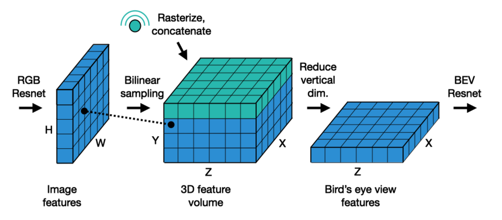

논문 제목에 **What Really Matters와 Multi-Sensor**라는 키워드를 봤을 때 BEV시스템에서 어떤 요소가 중요한 역할을 하는 지와 RGB카메라 외 다른 센서를 고려할 것을 제안함을 알 수 있다. 

논문을 읽으면서 참고하기 편하도록 논문과 같은 흐름으로 리뷰하였다.

# Abstract 및 I. Introduction

 최근 연구에서는 RGB카메라만을 이용하며 여러 lifting 방법을 제안하여 BEV를 생성하였으며 그 성능을 향상시켜왔다. 그러나 훈련 설정에서도 여러 세부 사항이 변경되어 왔기 때문에, 실제로 중요한 요소가 무엇인지 명확하지 않다. 또한, 이미 수년간 radar와 같은 추가 센서가 실제 차량에서 사용되어 왔기 때문에 카메라만 사용하는 시스템은 real-world senario에서의 제약 사항이 아니다. 

 몇몇 최근 연구에서 radar 데이터는 너무 sparse하여 유용하지 않다고 밝혔으나, 이 연구들은 레이더 단독 사용을 평가하였으며 multi-modal fusion을 다루지는 않음.(그림 1의 radar data를 보면 sparse한 것 처럼 보이기는 한다)

 본 연구의 contribution은 아래와 같다.

1. BEV perception models의 설계 및 훈련 프로토콜에서 높은 영향을 미치는 요소를 밝힘. Batch size, input resolution가 성능에 큰 영향을 미치는 반면, lifting 전략은 비교적 미미한 영향을 미친다는 것을 발견, 심지어 parameter-free한 간단한 lifter도 좋은 성능을 보임
2. 레이더 데이터를 활용하면 성능이 크게 향상됨. 레이더를 효과적으로 활용하는 방법을 분석하고, 커뮤니티에서 레이더에 대한 연구를 재고하도록 함.

# II. Related work

Parameter-free unprojection

- 이 방법에서는 각 3D 광선 방향을 따라 2D 특징을 복셀에 복사하여,2D에서 3D로 lifting하는 과정에서 추가적인 learnable parameters가 필요하지 않다.

Depth-based unprojection

- 이전 Lift, splat ,shoot과 같이 depth distribution을 사용한 3d volume 생성 방식이다. 그림 2의 우상단

Homography-based unprojection

- 각 픽셀별 깊이를 추정하는 대신, ground plane을 추정하는 방식을 사용한다. 이들은 이미지와 지면 사이의 관계를 나타내는 homography를 활용하여 특징을 변환하는 기법을 적용한다. 그러나, 이 방식은 장면자체가 평면적이지 않은 경우, 일반적으로 성능이 좋지 않다.
    - **Homography는 아래와 같이 projective transformation으로 변화시키는 변환행렬. -** [참고 자료](https://velog.io/@richpin/Computer-Vision-08-Image-Homographies)
    
        

    

MLP-based unprojection

- (그림 2의 좌상단)feature map의 높이 축(H)을 축소하여 bottleneck features를 생성하고 깊이 축을 확장하여 BEV를 생성한다. 높이축 축소와 깊이축 확장에 Fully Connected layer(MLP)를 사용.

Geometry-aware transformer-like models

- (그림2의 좌하단)transformer를 사용하여 polar BEV plane으로 inter-plane attention(2d feature map을 polar BEV plane에 mapping시키는 attention연산)을 수행하여 polar-BEV feature를 생성한 후 평면인 BEV feature로 변환함.
    - polar BEV plane이란 - [참고자료](https://arxiv.org/abs/2110.00966)
        
        
       
    - 일반적인 직교 좌표계 기반 BEV와 달리, 차량을 중심으로 반경(r)과 각도(θ)를 기반으로 BEV를 표현하는 방식.
- (그림2 우하단)BEV-former의 경우 parameter-free unprojection과 유사하지만 attetion 연산을 사용하여 deformable attention) 연산을 사용하여 특징을 sampling하는 방식 parameter-free unprojection의 bilinear sampling과 유사하지만, 추가적인 기능이 포함된다.

# III. SIMPLE-BEV MODEL

## A. Setup and overview

모델은 기존 연구를 따라 아래와 같은 과정으로 ouput을 출력하다.

1. 각 카메라 이미지에서 2D ResNet을 사용하여 feature 추출
2. 2D 특징을 3D로 lifting(lift-splat 과정이 기존의 연구들과 다름, 다음장 참고)
3. 3D 특징을 BEV 평면으로 축소
4. BEV 공간에서 2D ResNet을 적용하여 최종 출력을 생성

모델은 3d space의 resolution을 200 × 8 × 200로 하고 3D metric span을 100m × 10m × 100m로 한다. 복셀 length는 0.5m × 1.25m × 0.5m (in Z, Y, X order)가 된다.

## B. Architecture design

 3d coordinates를 그림 5와 같이 2d feature map에 projection시킨다. 그 후 projection된 영역의 2d feature맵 값을 bilinear sampling하여 복셀의 값을 채운다.(bilinear sampling은 2d feature map값을 bilinear interpolation하여 sampling하는것을 의미하는 것으로 보임). 

 그림 5에서 이러한 방식은 2d feature map에서 끌어와서 복셀을 채운다는 의미로 pull from 2D라고 표현.

 반대로 splat 방식은 2d를 depth distribution에 따라 복셀에 밀어넣는다는 의미로 push to 3D라고 표현.

Pull from 2D방식에서는 아래의 그림 6과 같이 카메라에 가까운 복셀은 이미지에서 더 넓은 영역을 샘플링(즉, 더 희소하게 분포)하고 카메라에서 먼 복셀은 이미지에서 더 밀집된 영역을 샘플링(즉, 더 촘촘하게 분포)한다.

위의 방식을 따라 3D feature volume을 생성한후 각 카메라에 대해 **이 3D 좌표가 카메라 시야내에 위치하는지를 나타내는** binary valid volume을 생성한다. 모든 카메라에서 얻은 3D 특징 볼륨을 유효성에 **따라 valid-weighted average하여 단일 3D 특징 볼륨**으로 축소한다.(valid volume이 binary이므로 frustum이 겹치지 않는 구간에서는 가중평균의 의미가 없을 수 있지만, 겹치는 구간에서의 값을 정하기 위해 사용하는 것으로 생각됨)

- C×Z×Y×X의 3D volume features를 생성
- BEV feature로 만들기 위해 C×Z×Y×X  →  (C⋅Y)×Z×X 로 차원 변환 (수직축을 채널 차원으로 확장함)

위와 같이 high-dimensional BEV feature map 생성.

 Radar가 주어진 경우 position **데이터**를 이용해 **grid 상에서 가장 가까운 XZ 좌표를 선택하고 그 위치에 15개의 non-position 데이터를 개별 채널로 사용하여** BEV 특징 맵을 생성한다.

- 따라서 BEV 특징 맵의 형태는R×Z×X,(여기서 R=15)
- LiDAR가 주어진 경우 binary occupancy grid로 복셀화함 —> Y×Z×X

아래 그림7과 같이 radar or LiDAR feature를 RGB feature와 concat함 

- (C⋅Y+R)×Z×X  →  C×Z×X   BEV를 표현하는 단일 평면의 feature map을 얻음

그다음, ResNet-18의 3개 블록을 사용하여 3개의 feature map을 생성한다.(아래의 그림8과 같이 feature pyramid를 생성하기 위해 3개의 feature map을 만든것으로 생각됨)

이후, upsampling 및 segmentation 작업을 수행하는 task head를 추가.

FIERY [21] 연구를 참고하여, segmentation head 외에도 보조 작업(centerness and offset prediction)을 추가하여 모델의 일반화를 돕는다.

- centerness and offset prediction에서 centerness와 offset이란 - [참고 자료](https://arxiv.org/abs/2104.10490)
    - centerness는 미래 시점(t+j)까지에 대해 인스턴스 중심이 존재할 확률을 나타내고
    - offset은 인스턴스 중심을 가리키는 벡터를 나타냄.
    - 아래의 그림 9 (b), (d)에서 centerness와 offset을 볼 수 있음.
    - segmentation map과 함께 사용하면, 주변 픽셀을 가장 가까운 인스턴스 중심에 할당하여 (f)와 같이 BEV instance segmentation을 형성할 수 있음.

## C. Key factors of study(Experiment 포함)

### Lifting strategy

2D에서 3D로 lifting하는 과정이 이전 연구보다 더 단순한 방식을 사용하며, parameter-free하다. 기존의 lifting 방법은 대략적으로 아래와 같다.

- 깊이 추정 후 splatting 방식(Lift, Splat, Shooting)
- MLP 기반 리프팅 방식
- attention 기반 리프팅 방식(BEVFormer)

기존의 lifting 방법들과 제안하는 방법 비교

| 리프팅 방식 | 개념 | 장점 | 단점 |
| --- | --- | --- | --- |
| Sampling (제안 기법) | 3D 복셀을 먼저 정의 후, 2D 이미지에서 bilinear sampling | 모든 복셀이 특징을 받음.카메라에서 먼 복셀은 이미지에서 더 밀집된 영역을 샘플링(즉, 더 촘촘하게 분포)하여 원거리 성능 증가 | 카메라에 가까운 복셀은 이미지에서 더 넓은 영역을 샘플링(즉, 더 희소하게 분포)하여 근거리 성능 저하 |
| Splatting (기존 기법) | 2D 픽셀에서 광선을 쏘아 일정한 깊이 간격으로 3D 복셀을 채움 | 근거리에서 더 많은 특징을 얻음 | 원거리에서 샘플 부족 발생 |
| Deformable Attention (최근 기법) | Sampling 방식과 유사하지만, 학습된 가중치와 오프셋을 적용 | 학습된 최적화된 샘플링 가능 | 연산량 증가 |

그림 10

- 가까운 거리에서는 splat 방식이 더 좋지만 먼 거리에서는 제안하는 방법이 더 좋은 성능을 보임.
- **splatting에서는** **가까운 복셀들은 여러 개의 샘플을 받지만(over-sampling), 먼 거리의 복셀들은 샘플을 거의 받지 못하거나(under-sampling), 경우에 따라 0개가 될 수도 있음.**

apples-to-apples(동일한 조건에서 성능 비고) 실험 결과 

- bilinear sampling과 deformable attention은 유사한 성능을 보였으며
- splatting 기반은 성능이 상대적으로 떨어짐.
- Multi-scale deformable attention(BEVFormer)는 가장 뛰어난 성능을 보였지만, 학습 속도가 1일 더 느리고, 테스트 시 0.5 FPS 느려지며, 모델 복잡도(42M → 59M)가 증가함.

### Input resolution

그림 11

- 최고 성능은 672 × 1200 해상도에서 49.3 IOU를 기록.
- 그러나, 672 × 1200은 448 × 800보다 속도가 크게 느림.
    - 추론 시간(inference time): 133ms vs. 83ms
    - 학습 시간(training time): 약 2배 소요
- 최고 해상도에서 성능이 다시 저하됨.
    - 입력 이미지 크기가 너무 커지면서, 객체의 스케일이 backbone의 pre-training과 차이가 나기 때문

### Batch Size

BEV 연구에서는 배치 크기가 성능에 미치는 영향에 대한 논의가 거의 이루어지지 않았음. 그 원인 중 하나는 BEV 모델이 매우 높은 메모리를 요구하기 때문. 본 연구에서는 multiple steps and multiple GPUs에서 gradient를 accumulate 함. (한 배치 사이즈에서 그래디언트를 계산하고 가중치를 업데이트 하는 것이 아니라 다음 스탭 배치의 그래디언트를 누적하여 배치사이즈를 늘린것과 같은 효과를 냄.)

배치사이즈를 늘릴수록 성능 향상됨.

### Backbones

 더 깊은 backbone을 사용할수록 성능이 향상됨

### Augmentation

이전 연구에서는 camera dropout 및 다양한 image-based augmentations을 사용하는 것이 권장되었으나,

이러한 요인들이 성능에 미치는 영향이 정량적으로 측정된 사례는 거의 없었다. 학습중 다양한 데이터 증강 기법을 실험적으로 적용하고, 각각의 독립적인 효과를 측정함.

- random resizing & cropping
- 랜덤하게 하나의 카메라를 reference 카메라로 설정
- 6개의 카메라 중 하나를 무작위로 drop
- 위의 augmentation을 사용한 경우 성능이 향상됨.

### Radar usage details

이전 연구에서는 **nuScenes 데이터셋의 레이더 데이터가 너무 sparse 하여 유용하지 않다고 하였으나, 카메라 기반 시스템에서 부족한 metric 정보의 중요한 소스로 활용될 수 있음.**

- **LiDAR가 가장 높은 성능을 보였**나, **RGB+LiDAR와 RGB+Radar의 성능 차이가 예상보다 크지 않음.**
- **그림13 에서 융합된 모델의 정성적 결과를 시각화**하며, **RGB 정보와 결합된 레이더 데이터가 BEV에서 더 정확한 semantic segmentation을 가능하게 한다**는 점을 확인함.

### comparison with state-of-the-art

각 기존 연구는 학습 설정이 다르므로, 본 비교는 동일 조건 비교(apples-to-apples comparison)로 해석되어서는 안 된다.

- 기존의 모든 RGB 기반 및 temporal 모델을 소폭 능가하였다.
- Simple-BEV는 42M parameters를 가지며, BEVFormer(68.7M)보다 상당히 효율임.
- 모델의 주요 bottleneck은 ResNet-101 backbone에서 발생하며, 전체 42M 파라미터 중 37M이 ResNet-101에 할당됨.
- 추론 속도 측면에서 기존 연구보다 3배 빠름.