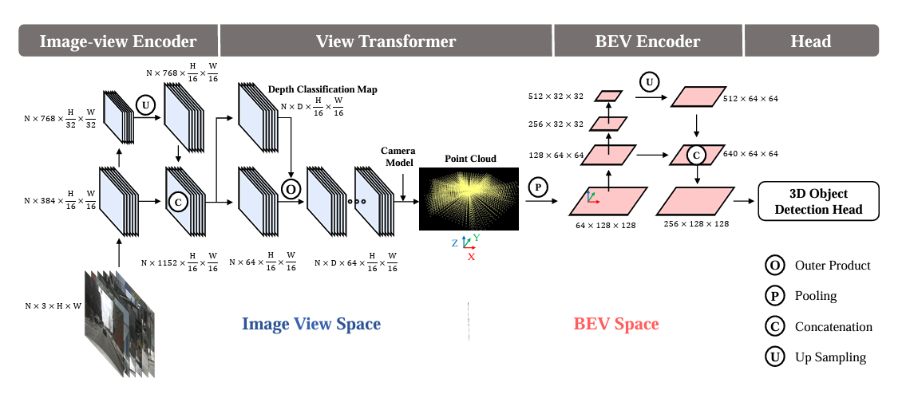
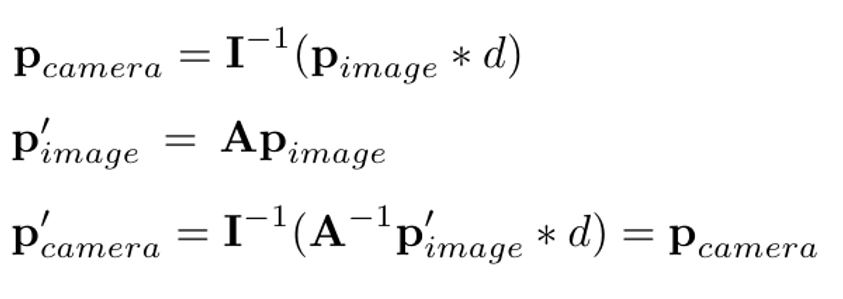
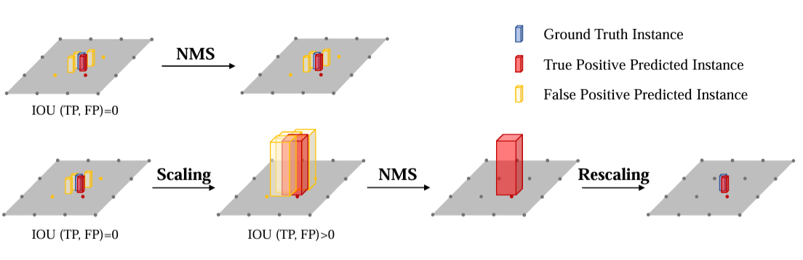
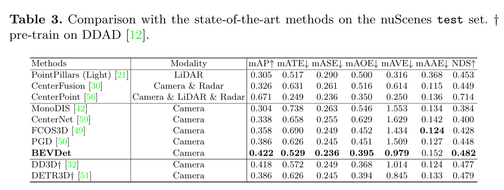
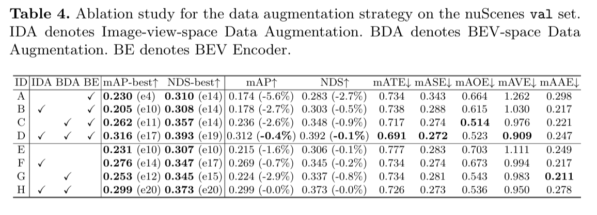
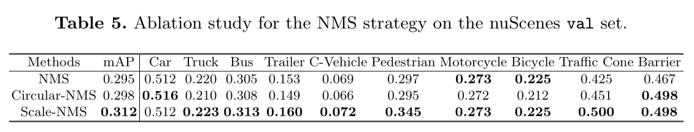

# 1. Introduction

- 2D perception에서는 Mask R-CNN 같은 모델이 multi-task에 있어 좋은 성능을 보이지만 3D perception 모델들은 서로 다른 패러다임의 모델들이 각 분야에서 좋은 성능을 보인다.
- 예를 들어, nuScenes 데이터셋에 대해 3D object detection은 FCO3D, PGD와 같은 image-view-based 방식이 효과적이며, BEV semantic segmentation 분야에서는 PON, LSS, VPN과 같은 BEV  방식이 지배적이다.
- 본 논문에서는 BEV가 3D object detection에서도 이점을 가져갈 수 있음을 보이며 multi-task learning을 할 수 있는 단일 프레임워크를 제안한다.
- 제안하는 프레임워크는 image-view encoder, view transformer, BEV encoder, task-specific head와 같이 4개의 모듈로 구성되어 다른 task에서 효과적인 모델의 구조를 가져와 쓰기 용이하다는 이점이 있다.
- 또한,  BEV encoder가 없을 때만 효과적인 기존의 data augmentation 기법을 보완하기 위해 BEV space에서의 data augmentation 기법을 제안한다.
- 마지막으로, 3D object detection에 맞는 Non-Maximum Suppression (NMS)를 제안하여 추론 속도를 높인다.

# 2. Related Work

## 2-1. Vision-based 2D Perception

- Classification은 AlexNet 이후 급격한 발전
- 더 깊은 네트워크 구조를 적용할 수 있는 ResNet, 더 선명한 특징을 추출할 수 있는 high-resolution 모델 등이 나왔다.
- 객체의 종류와 위치를 예측하는 object detection 분야에는 RetinaNet, Mask R-CNN 등이 있다.

## 2-2. Semantic Segmentation in BEV

- 차량 주변 환경을 Bird-Eye View (BEV) 형태로 변환하여 분석하는 것은 차선 인식, 주행 가능 지역 검출, 주차 공간 탐색 등에 유용하게 활용된다.
- 일반적으로 카메라 영상의 특징을 추출하는 image-view encoder, 이미지 뷰를 BEV 뷰로 변환하는 view transformer, BEV 특징을 추가 인코딩 하는 BEV encoder, 픽셀 단위 결과 예측을 하는 classification head로 구성된다.

## 2-3. Vision-based 3D Object Detection

- 기존의 3D Object Detection
    - FCOS3D: 3D 객체 검출을 2D 검출 방식으로 해결, 공간적 상관성을 활용하여 좋은 성능
    - DETR3D: Transformer 기반 attention 구조 활용, FCOS3D와 비슷한 성능이지만 연산량이 절반
    - PGD: FCOS3D의 target depth 예측 성능 문제를 개선
- BEV 기반 3D Object Detection으로는 Lift-Splat-Shoot (LSS)이 BEV 방식으로 깊이 정보를 학습

# 3. Methodology

## 3.1 Network Structure

- Image-view Encoder: ResNet과 Swin-Transformer를 default로 활용
- View Transformer: LSS에서 제안한 방식 활용하여 depth를 classification. 범위는 [1,60]이며 간격은 1.25 x r
- BEV Encoder: ResNet backbone + FPN-LSS의 multi-resolution combination 활용
- Head: CenterPoint의 1st stage를 적용

## 3.2 The Customized Data Augmentation Strategy

 

- 이미지 좌표에 depth와 Intrinsic parameter(I)를 적용하면 3D 좌표를 표현할 수 있다
- A는 flipping, cropping 등을 나타내는 3x3 transformation matrix로 augmentation에 활용된다.
- Image space에서 복원을 하기 때문에 BEV space에는 영향을 미치지 않는다.
- BEV space는 multi-camera로부터 하나의  feature가 만들어지므로 과적합에 더욱 취약하다.
- 본 논문에서는 최신 LiDAR 기반 연구들에서 사용되는 일반적인 augmentation을 BEV에도 적용하여 과적합을 방지한다.

## 3.3 Scale-NMS

- 이미지는 perspective라는 특성 때문에 모든 카테고리가 유사한 spatial distribution을 가지는 반면 BEV에서는 카테고리에 따라 차지하는 면적의 스케일에 차이가 존재한다.
- 예를 들어, 보행자나 교통 콘과 같은 객체는 지면에서 차지하는 면적이 매우 작아 알고리즘의 출력 해상도(CenterPoint에서는 0.8m)보다 작아 NMS가 정상 동작 못할 수 있다.
- 본 논문에서는 Scale-NMS를 제안하여 객체의 크기를 카테고리에 따라 확장하여 NMS를 적용할 수 있도록 만들었다.

# 4. Experiment

## 4.1 Experimental Settings

- 데이터셋: 6개의 카메라에서 촬영된 1000개 장면 포함하며 10가지의 클래스가 존재하는 nuScenes 활용
- 평가 지표: mAP, NDS, ATE,  ASE , AOE, AVE, AAE
- 학습 설정: AdamW, ResNet,  SwinTransformer, 20 epochs
- 데이터 전처리: 1600x900의 해상도, random transformation을 이미지와 BEV에 각각 적용

## 4.2 Benchmark Results

## 4.3 Ablation Studies

- IDA: Image-view-space Data Augmentation
- BDA: BEV-space Data Augmentation
- BE: BEV Encoder

